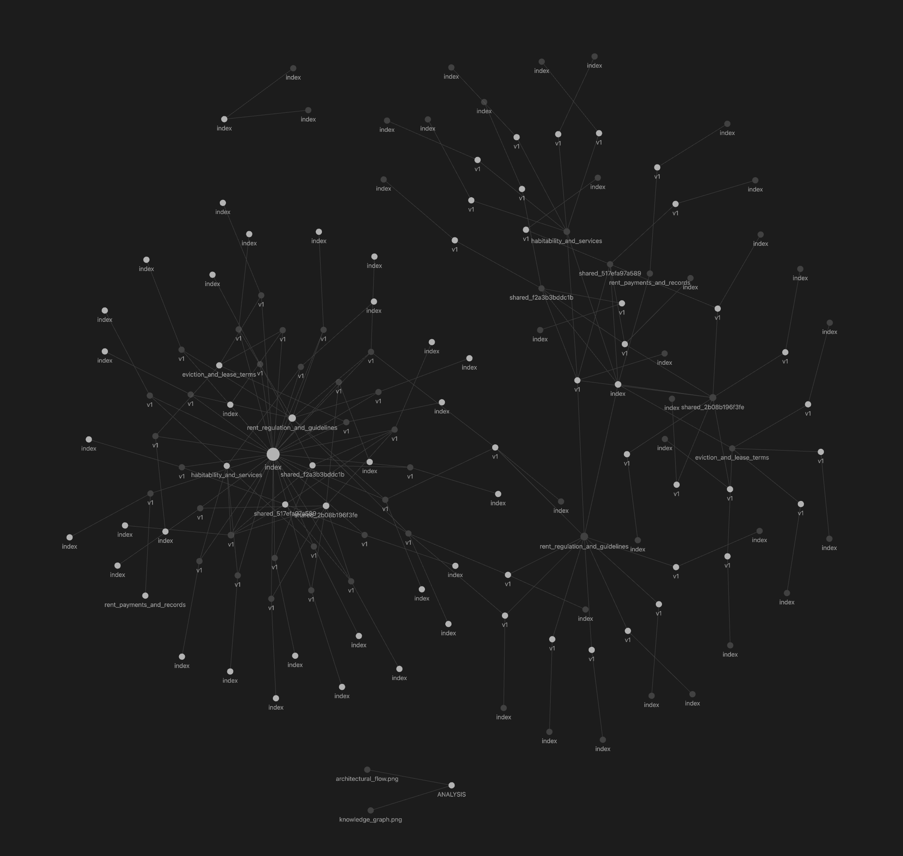
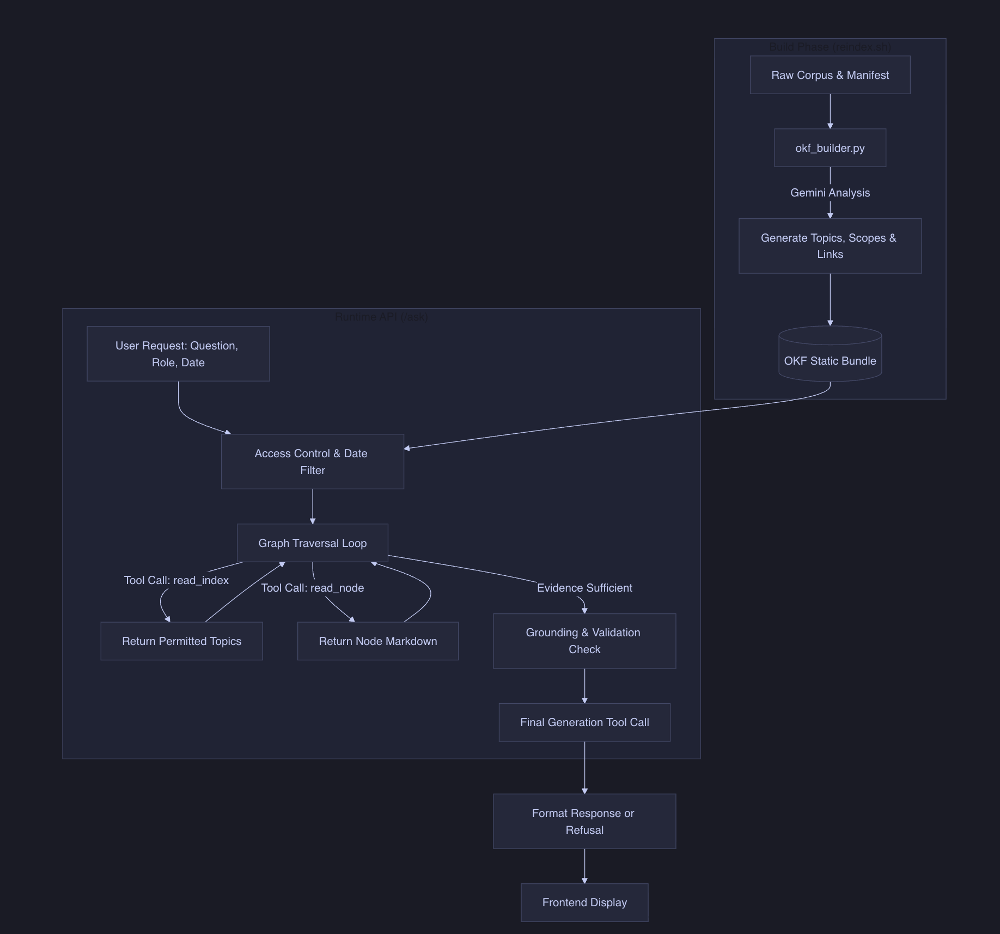

# Implementation Analysis

## The Task at Hand
The objective is to build a housing rules assistant that accurately answers questions from New York renters using a fixed set of documents. This is not a standard question-answering task; it requires strict adherence to source material (no hallucinations), handling contradictions between different rules (e.g., state law vs. openigloo policy), respecting explicit role-based access controls (renters cannot see landlord-only documents), and maintaining "freshness" (dynamically adapting to rule changes based on effective dates). 

## Why Simple RAG and Standard Graphs Fall Short
A simple RAG (Retrieval-Augmented Generation) pipeline relies on semantic similarity using vector embeddings. While great for general knowledge, it struggles deeply with legal texts. Vector similarity does not natively understand effective dates, document versioning, or strict access permissions. It often retrieves the "most semantically similar" chunk, which might be an outdated rule or an unauthorized document, leading to catastrophic leaks or incorrect legal advice.

Alternatively, a standard Knowledge Graph (like RDF or a property graph using Neo4j) requires a highly rigid ontology and complex query languages (like SPARQL or Cypher). Mapping arbitrary, evolving legal text into strict triples is brittle, engineering-heavy, and difficult to maintain when a new, unseen document type is introduced.

## The "LLM Wiki" Concept
To solve this, I considered an "LLM Wiki" approach. Instead of chunking documents into a vector database, what if we organized them like an internal wiki? Documents are grouped into readable pages and logically linked (e.g., an openigloo policy page contains a hyperlink to the underlying NYC law). During retrieval, the LLM acts like a human navigating a wiki—it lands on an index, clicks on a topic, reads a summary, and navigates to the exact rule needed. This provides immense contextual clarity and natively handles contradictions because the LLM can trace the hierarchy of the rules through the links.

## Enter OKF (Open Knowledge Format)
To formalize the LLM Wiki, I adopted the **Open Knowledge Format (OKF)**. OKF represents knowledge as a bundle of Markdown files paired with structured JSON metadata (`manifest.json` and a relationship graph). 

**Why OKF over a raw LLM Wiki?** 
While an LLM Wiki provides the semantic structure, it lacks strict computational boundaries. OKF adds deterministic, programmatic access control on top of the wiki. Before the LLM is allowed to "read" or "click" an OKF node, the underlying retrieval engine checks the OKF metadata. If the node's `as_of` date is expired, or its `role` visibility restricts the current user, the engine mathematically blocks the LLM from seeing it. OKF gives us the semantic flexibility of a wiki with the strict, deterministic security of a database.

## Knowledge Graph Construction and Traversal
**Construction:** The graph is built statically. A builder script (`okf_builder.py`) processes the raw corpus and uses an LLM (Gemini 3.5 Flash-Lite) to analyze the texts, generate overarching topics, and explicitly map conflict and interpretation links between rules. It then outputs standard Markdown files and a `knowledge_graph.json` defining these links.

**Traversal:** At runtime, the process is iterative:
1. The user asks a question, providing their `role` and the `as_of` date.
2. The LLM starts at the root OKF index.
3. It requests to read a specific topic or document link.
4. The system validates the request against the OKF metadata (date and role checks).
5. The LLM reads the permitted markdown content. If it detects a contradiction or a linked rule, it requests to navigate further.
6. Once it has enough evidence, it generates the final answer with exact verbatim quotes.

*Above: A visualization of the generated Open Knowledge Format graph.*

As seen in the image, the graph is organized hierarchically. It begins with a central **index** node that branches out into broad legal topics (e.g., `rent_regulation_and_guidelines`, `eviction_and_lease_terms`, `habitability_and_services`). These topics then link directly to specific versioned document nodes (e.g., `v1`). 

**Versioning and Updating the Corpus:**
This structure makes versioning and adding new documents incredibly simple. To add a new rule or amend an existing one, you simply drop the new document text into the corpus folder and run the `reindex.sh` script. The builder automatically generates a `v2` node for the updated document, adjusts the effective dates in the metadata, and updates the graph links. The old `v1` node remains in the graph for historical queries but is mathematically ignored for current queries. Because it is a static build process, the runtime system requires no complex database migrations.

## Architectural Flow and Tool Calls
The entire flow is designed around deterministic safety and iterative tool calling:

*Above: A visualization of the architectural flow and tool calls.*

**Tool Call Breakdown:**
Typically, answering a question takes about **3 to 5 distinct tool calls**:
1. **Navigate Index**: The LLM calls a tool to read the root index.
2. **Explore Concepts/Nodes**: The LLM calls a tool to read 1-3 specific OKF nodes based on the index. The system intercepts these calls to enforce strict date and role restrictions.
3. **Assess Restrictions**: An isolated tool call to check restricted scopes.
4. **Final Generation**: A separate final call uses the collected, strictly validated evidence to generate the exact answer and verbatim quotes. 

## Decisions & Answers to Brief Questions
- **Chunking, Indexing, and Versioning**: The corpus is retained in its supplied chunks, but OKF organizes them by section. "In force" dates are represented as metadata boundaries; the system filters out passages not valid on the `as_of` date before the LLM can read them.
- **Handling Contradictions**: When rules conflict (e.g., city vs. state law, or openigloo policy vs. law), the system is instructed to present the controlling rule (the policy or the strictest law) but explicitly mention the conflict and why one governs. 
- **Refuse-or-Answer Threshold**: The system is tuned for high precision. If the necessary evidence is not explicitly found in the retrieved OKF nodes, it returns `out_of_corpus`.
- **Role Filtering**: Filtering happens strictly at the **retrieval** layer. The LLM never sees restricted documents for an unauthorized role, mathematically eliminating the chance of a leak from the text.
- **Frontend for Lawyer Questions**: The UI provides the known rules and boundaries but clearly states when human/legal intervention is required, refusing to offer definitive legal conclusions.
- **Re-indexing Cost and Operations**: Re-indexing takes under 15 minutes and costs negligible API tokens. An operations team can trigger a simple bash script to rebuild without engineering intervention.
- **Unseen Document Types**: If presented with an unseen document type (e.g., a court decision), the builder indexes it as standard text. However, the system won't automatically understand its legal hierarchy relative to existing laws without manual relationship mapping.
- **Failure Taxonomy of First Working Version**: My initial implementation used keyword selection and occasionally converted API failures into corpus refusals. Moving to actual bundle traversal resolved the false corpus refusals, and implementing validation checks improved support percentages.

## Deterministic and Judge Results
Using Gemini 3.5 Flash-Lite, the development results show 96.7% coverage and 100% verbatim quotation accuracy. 
- **Temporal Slice**: Temporal correctness reached 73.7%. Failures occurred mainly when complex effective-date context was missed during traversal.
- **Contradiction Slice**: Contradiction handling was at 41.2%, primarily because the free-tier model struggled to hold and compare multiple conflicting passages effectively in a single pass.
- **Simulated Rule Change**: I simulated a rule change (increasing a fee threshold and archiving a policy). The system correctly answered historical queries with old rules and current queries with the new ones.

## Improvements and Next Steps
- **Model Upgrades**: I used the free tier of Gemini 3.5 Flash-Lite for both KG creation and final answering. Using a better, larger model (like Gemini 3.1 Pro or a flagship OpenAI model) for building the graph would drastically improve the quality of generated topics and relational links. A larger model for final generation would also hold context better, fixing the poor performance on the contradiction and interpretation slices.
- **Fixing Lacked Metrics**: To improve citation support and contradiction scores, the next version will explicitly force the model to map every claim to a specific timestamped and role-verified OKF node before generating the final text.

## New Files and Repository Structure
The following files and directories were added or significantly modified for this implementation:
- `ANALYSIS.md`: My analysis of the approach, architecture, and judge scores.
- `MEMO.md`: Memo explaining operations, risks, and a 1-year cost estimate.
- `SETUP_GUIDE.md`: Instructions on how to set up, reindex, and run the service.
- `service/`: The FastAPI backend, including the OKF graph traversal and LLM integration.
  - `ask_service.py`: Main FastAPI application handling `/ask` requests.
  - `config.py`: Environment configuration and setup.
  - `gemini.py`: Wrapper for Gemini API interactions.
  - `graph_traversal.py`: Logic for traversing the OKF knowledge graph.
  - `okf.py`: Core components of the Open Knowledge Format representation.
  - `okf_builder.py`: Script that constructs the OKF bundle from the corpus.
  - `prompts.py`: LLM prompts for traversal and generation.
  - `requirements.txt`: Python dependencies.
  - `run_questions.py`: Script to execute questions against the local API.
- `frontend/`: The web application that allows testing the application.
  - `index.html`: The HTML/JS/CSS source for the web interface.
- `scripts/`: Execution scripts to automate the lifecycle.
  - `reindex.sh`: Rebuilds the OKF bundle.
  - `reproduce.sh`: Runs the full evaluation pipeline.
  - `serve.sh`: Starts the API and frontend servers.
- `results/`: Output directory where the final answers and run manifests are stored.

### OKF Bundle Sub-Structure
When you run `scripts/reindex.sh`, the system compiles the corpus into an Open Knowledge Format (OKF) bundle in the `corpus/okf_bundle/` directory. This directory is intentionally not checked into version control since it can be fully rebuilt. The bundle contains:
- `manifest.json`: A generated manifest that organizes the documents and their allowed roles.
- `knowledge_graph.json`: The relationships (topics, conflicts, definitions) generated by the LLM build step, mapping how different rules interact.
- `docs/`: Markdown versions of every rule, structured so the LLM can easily read and traverse sections.
- `topics/`: High-level category pages mapping broad queries to specific legal rules.

This bundle acts as the deterministic graph for the LLM to traverse, replacing standard vector-based chunk retrieval.
